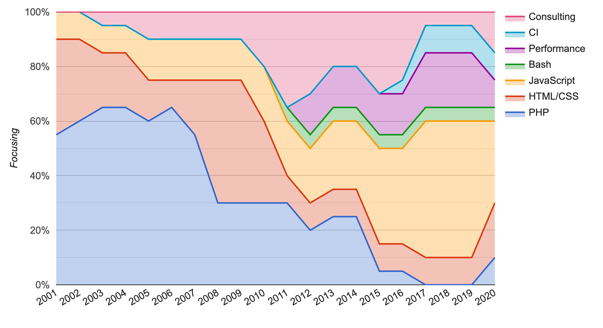

# André Lademann

> A resume is like a DOM, you never know until you really inspect it!

## Links

- GitHub https://github.com/vergissberlin
- LinkedIn https://www.linkedin.com/in/andré-lademann-a8564268/
- Xing https://www.xing.com/profile/Andre_Lademann

## 42 points of interests

JavaScript, Load testing, Usability, Accessibility, VueJS, Docker,
Node JS, Performance, ESI, Varnish reverse proxy, Extbase, Deployment,
Google Chrome Extensions, Regressive testing, functional testing,
acceptance testing, unit testing, bdd, Codeception, PWA, Ionic Framework,
jQuery, jQueryUI, git, Continuous Integration, Concourse CI, socket.io,
Firebase, TYPO3 CMS, Lighttpd, Nginx, Code Review, PHP, Symfony Framework,
Internet of Things, Raspberry PI, NAS, Zanox, DBPedia, Semantic Web, RDF

## Knowledge focus timeline

## Knowledge areas

### Consulting

As technical project lead of a big project for **AIDA Cruises** I had the opportunity to work with colleagues from around the world. Together with **LG Business Solutions**, **Lufthansa Systems**,
**Mitsubishi**, **AIDA Cruises** and other Companies.
I was in charge with the installation and configuration of an on-board information system for guests
on a Cruise Line vessels. The special challenges here were the work on the ship during the crossing from Japan to Europe, and the
coordination of the team in Germany. I really enjoined that work!
In my daily business, I am in a team, which works very closely together with the customers. It is my part to explain complex technical procedures in a customer speech.
I also do trainings and record screencasts. I also like sharing and gaining new things.
That's why you often see me on user groups, bar camps and other conferences as a listener and speaker.

### User Experience

In short. Human-computer communication was my favorite course in college. I like it to build prototypes,
to make tests with it, to fail, to create new prototypes and find solutions which are very suitable for
the user.
For prototyping I prefer in paper prototypes, interactive prototypes (created with e.a. Marvelapp).
These days, you got also results very quickly with frameworks like vuejs.
In my work as a developer, I had the opportunity to develop
software for various output devices. In addition to the usual
like smartphones, notebooks and desktop devices, should also
implement the user interface for various terminals and TVs.

In my free time, I'm a tester on testbirds (https://www.testbirds.com/),
a crowd based testing provider. There you create screencast for unreleased
prototypes, and give them feedback for a little money. For me it is a nice
way to have a look on web applications with different eyes.

### Accessibility

When it comes to improve the accessibility, often there is not much time left for it.
Especially in non-governmental projects.

### Performance

Get sweaty when you 1000+ concurrent user request on your web server with a
running php application which is a script language? Not me! That's the point
where the funny part starts, mostly. Because I know, I am prepared! To prevent
blackouts, I had projects with a huge amount of concurrent user request.
I took care about all the different cache layer.

#### Client

- Browser cache
- Local storage
- Cache API
- Offline first principle

#### Server

- Byte cache
- parallel processes
- precompiling

#### Routing

- CDN
- Load balancer
- Reverse proxy

#### Architecture

- Reduce requests (sprites, icon fonts, inline code)
- Compress code
- Lazy load
- Critical css

#### Example projects

- Open Performance Monitor https://github.com/vergissberlin/opm_server
- Varnish, Load balancer, last testing on large scale application (dynamo-dresden.de)
- Load tests with jMeter with blazemeter and blitz.io

### Performance analyse

#### Client

- Chrome 63+ Performance monitor
- Lighthouse

#### Server

- Prometheus & Grafana
- htop, iotop, iperf, siege
- jMeter
- Locust.io

#### SaaS

- New Relic
- Blazemeter
- Google Analytics
- Google PageSpeed Insights

### Search Engine Optimization & Semantic Web

Of course, for my customers it is very important that someone can see there amazing thing they build.
That's why SEO is import part of my work. From the developer side it makes
fun to improve the performance, put the data in a semantic structure and measure
the success. As a consultant to my customers I describe carefully how important
useful content is.
Semantic, machine ead and understandable structures with RDF and semantic HTML.
I'm involved in the project LEDS (https://www.leds-projekt.de). I've build a prototype plugin
to enhances the content in WYSIWYG editors and can be use in content management systems.

#### Examples

- Semann https://netresearch.github.io/semann/

## Languages

### JavaScript ECMAScript 6

I started with PHP 15 years ago, the time is come where I felt in love with JavaScript.
On server side to implement microservices quickly, to build command line tools or
just start a small web server with websockets.
On client side, the language is no less powerful. The common browsers have APIs build in
for data storage, websockets, push notification, sensors like accelerometer, compass, gps,
camera and microphone.
I build many applications like Live Chats, a counter for the table counter in my agency,
a coffee waste alert the coffee machine (of course with websockets), extensions for Chrome.
My latest app is CamFight (https://camfight.surge.sh). It was a challenge with a friend and
my bosses to create an photo game application in just three days. It became five days but
it was fun!

#### Example projects

- Google Chrome Extensions
- Mobile photo game application "CamFigth"´
- IoT - CoffeeBin

### PHP

I'm a native PHP speaker. It is one of the most used language for the internet.
Even big pages like Facebook are build with it.
For me as a teenager, it was the entry in hole new world.
I appreciate the community a lot.

#### Example projects

- AIDA Cruises board portal
- Dynamo Dresden
- Siamar Reisen

### German (native)

German was one of my major subjects in high school.

### English (fluid)

As a consultant and developer in a international context, it is my daily business
to read, write, program, listen and speak in english. With companions in open source projects,
and colleagues from India and the USA with whom I work as an employee.
In the meantime, it does not make any difference to me to enjoy a movie,
whether the film is in German or English.
Sometimes one or other word I don't know, but I have the experience that you can still
communicate very well. Except with Korean colleagues. I still understand these very bad.
On the other hand I had very good experiences with colleagues from europe. Especially
with Eastern Europeans.

### Continuous integration, continuous delivery

In the past 3 year, continues delivery got more and more important to me.
One big part of it is testing. My focus is the Frontend testing with functional,
acceptance and regressions tests. The run these kind of tests, there is a need to
start the whole application.
There have been SaaS vendors offering this for a while, but often the terms of the
contract do not allow the source code to leave the house.
Thanks to Docker and ConcouresCI, this is no longer a problem.
To run tests on different browser with a selenium hub it becomes so easy these days.

#### Example projects

- **Universal Music** build pipeline with acceptance tests
- Multistage continuous deployment pipeline for _St. Benno Verlag_

### Others

I also worked with Java, Groovy, Ruby and a lot with bash. In my early days of programming
as a programmer für motor.fm, Senator and Kinowelt I also get in touch with Flash, Photoshop,
InDesign, Illustrator. I made animated adds and hole web applications with it.

#### And not forget these

- SQL (MySQL)
- SCSS
- RDF
- Semantic HTML

#### Example projects

- ct3
- PacHub - contributions timeline designer

## Best practices

### Open source

- PacHub https://github.com/PacHub
- Chrome Extensions
- Bashlight commandline enhancer https://github.com/vergissberlin/bashlight
- IoT CoffeeBin - https://github.com/vergissberlin/coffee-bin
- OpenTX speech generator https://github.com/vergissberlin/opentx-speech-generator
- Docker developer images https://hub.docker.com/u/vergissberlin/
- Mobile photo game application CamFight https://camfight.surge.sh

### Other interests

- Basketball
- Play guitar in a band of developer
- Long distance bike trips
- I'm a drone pilot
